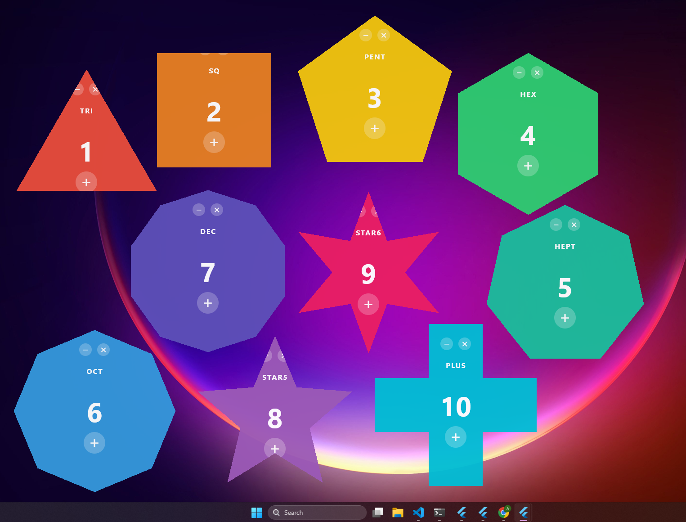

# polygon_demo

Showcase example for `icefelix_window_manager`'s `setShape` API on Windows:
a Flutter app whose OS window is literally non-rectangular. Pixels outside
the polygon don't paint and **clicks on those areas pass through to the
desktop** (true `SetWindowRgn` shaping, not just a clipped widget).



## What this exercises

| Concern | Method |
|---|---|
| Strip window chrome | `setFrameless(true)` |
| Fixed window size | `setSize(...)` |
| Translucency | `setOpacity(0.95)` |
| Center on the primary display | `center()` |
| Non-rectangular window region | `setShape([Offset(...), ...])` |
| Drag from any pixel inside the polygon | `startDrag()` |
| Minimize button (replaces native one) | `minimize()` |
| Close button | `destroy()` |

Window position, shape, label and color come from argv so a launcher
script can fire up a swarm of differently-shaped windows for promo art:

```powershell
polygon_demo.exe --shape=hexagon --label=HEX --color=2ECC71 --x=400 --y=100
polygon_demo.exe --shape=star5   --label=STAR5 --color=9B59B6 --x=800 --y=100
# ...
```

## Run

```powershell
cd packages\icefelix_window_manager\example\polygon_demo
flutter pub get
flutter run -d windows
```

Single window opens with a hexagonal shape, counter starting at 0, and
the three controls inside the polygon: drag from anywhere, `+` to
increment, `−` to minimize, `✕` to close.

## Supported `--shape=` values

`triangle`, `square`, `pentagon`, `hexagon`, `heptagon`, `octagon`,
`decagon`, `star5` (5-point star), `star6` (6-point star), `cross` (plus
sign).
